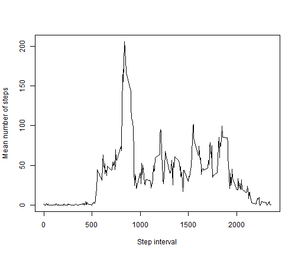

# Reproducible Research: Peer Assessment 1
========================================================


## Loading and preprocessing the data

```r
setwd("C:/Users/Helga/Documents/gabriel/cursos")
# point to activity.csv
bd = read.csv("activity.csv", header = T)
# convert date
bd$date = as.Date(bd$date, "%Y-%m-%d")
# Prepare for English week days
Sys.setlocale("LC_TIME", "English")
```

```
## [1] "English_United States.1252"
```

```r
sum_steps <- aggregate(steps ~ date, bd, sum, na.rm = TRUE)
```


## What is mean total number of steps taken per day?

```r
hist(sum_steps$steps, col = "Red", main = "Total number of steps taken per day frequencies", 
    xlab = "Total number of steps")
```

 


```r
meansteps = mean(sum_steps$steps, na.rm = T)
mediansteps = median(sum_steps$steps, na.rm = T)
```


* The __mean__ total number of steps taken per day is _1.0766 &times; 10<sup>4</sup>_
* The __median__ total number of steps taken per day is _10765_

## What is the average daily activity pattern?

```r
mean_steps_interval <- aggregate(steps ~ interval, bd, mean, na.rm = TRUE)
```


```r
plot(mean_steps_interval$interval, mean_steps_interval$steps, type = "l", xlab = "Step interval", 
    ylab = "Mean number of steps")
```

 


```r
maxIdx = which.max(mean_steps_interval$steps)
maxInterval = mean_steps_interval[maxIdx, "interval"]
maxAvgStep = mean_steps_interval[maxIdx, "steps"]
```

* On average across all the days in the dataset,the 5 minute interval "__835__" contains maximum mean number of steps (_206.1698_ steps)

## Imputing missing values

```r
totalNA = sum(is.na(bd$steps))
```

* The total number of __missing (NA)__ values is _2304_

Apply a single imputation method (by considering data missing completely at random - MCAR - i guess): substitution by the mean.

```r
naIdx = which(is.na(bd$steps))
naInterval = bd[naIdx, 3]
fillSteps = sapply(naInterval, function(x) {
    mean_steps_interval[(mean_steps_interval$interval == x), 2]
})

nbd = bd
nbd[naIdx, "steps"] = fillSteps  #fill in missing data

NsumStep = aggregate(steps ~ date, nbd, sum)
```


```r
hist(NsumStep$steps, col = "Red", main = "Total number of steps taken per day frequencies", 
    xlab = "Total number of steps")
```

 

```r
meanStepNew = mean(NsumStep$steps)
medianStepNew = median(NsumStep$steps)
```

* The __mean__ total number of steps taken per day was _1.0766 &times; 10<sup>4</sup>_ and now it is _1.0766 &times; 10<sup>4</sup>_ thus being the same while the __median__ total number of steps taken per day was _10765_ and now it is _1.0766 &times; 10<sup>4</sup>_ which is not a big difference.

## Are there differences in activity patterns between weekdays and weekends?

```r
# create a new factor variable 'wd' with two levels 'Weekday' and 'weekend'
bd["wd"] = factor(sapply(bd$date, function(x) {
    if (weekdays(x) == "Sunday" | weekdays(x) == "Saturday") {
        "weekend"
    } else {
        "weekday"
    }
}))

# calculate the mean number of steps given time interval and wd
meanwd = aggregate(steps ~ interval + wd, mean, data = bd)

library(lattice)
xyplot(steps ~ interval | wd, data = meanwd, type = "l", layout = c(1, 2), xlab = "Interval", 
    ylab = "Mean number of steps")
```

 

